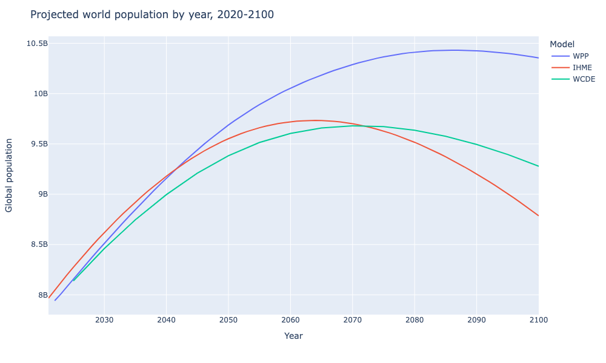

# Population Projections

This repository contains Python scripts which normalize the outputs of global population projections into a common format.

## Introduction

There are at least three widely cited models of global population growth up to the year 2100. However their outputs, while published openly, are in varying formats (see table below). This Python module normalizes the outputs from the three models for wider accessibility and for comparative analysis.

## Model comparison

| Model | Citation                                                     | 🔗                                                            | Reference scenario | Data source                 | Data resolution |
| ----- | ------------------------------------------------------------ | ------------------------------------------------------------ | ------------------ | --------------------------- | --------------- |
| WPP   | United Nations, Department of Economic and Social Affairs, Population Division (2022). World Population Prospects 2022, Online Edition. | [🔗](https://population.un.org/wpp/)                          | Medium scenario    | XLSX document               | 1 year          |
| WCDE  | Wittgenstein Centre for Demography and Global Human Capital, (2018). Wittgenstein Centre Data Explorer Version 2.0. | [🔗](http://www.wittgensteincentre.org/dataexplorer)          | SSP2               | Git repository of CSV files | 5 years         |
| IHME  | Institute for Health Metrics and Evaluation (2020). Global Fertility, Mortality, Migration, and Population Forecasts 2017-2100. | [🔗](https://ghdx.healthdata.org/record/ihme-data/global-population-forecasts-2017-2100) | Reference scenario | Compressed CSV file         | 1 year          |

## Usage

The `population_projection` module contains submodules for each projection: `wpp`, `ihme` and `wcde`.

`projection.REMOTE_URL`: The URL where the data file can be fetched. This must be downloaded first to the filesystem.

`projection.read_file(filename)`: Read a data file and output timeseries data as a Pandas dataframe.

## Example

```python
from projections import wpp, ihme, wcde
from wget import download

# Download all data files from the respective sources
wpp_file = download(wpp.REMOTE_URL)
ihme_file = download(ihme.REMOTE_URL)
wcde_file = download(wcde.REMOTE_URL)

# Parse the data files
wpp_projection = wpp.read_file(wpp_file)
ihme_projection = ihme.read_file(ihme_file)
wcde_projection = wcde.read_file(wcde_file)

# Join the dataframes together.
projections = [wpp_projection.rename(columns={"population": "WPP"}),
               ihme_projection.rename(columns={"population": "IHME"}),
               wcde_projection.rename(columns={"population": "WCDE"})]
projection_data = pd.concat(projections, axis=1, join="outer")

# Select only data after 2020.
chart_data = all_data[all_data.index > 2020]

# Plot the data with Plotly.
fig = px.line(chart_data, x=chart_data.index, y=["WPP","IHME","WCDE"])
fig.update_layout(
    title="Projected world population by year, 2020-2100",
    xaxis_title="Year",
    yaxis_title="Global population",
    legend_title="Model"
    )
fig.update_traces(connectgaps=True)
fig.show()
```



## Further work

Work to be done:

- Normalization of regions and country names to ISO standards
- Segmentation by age and sex
- Historical estimates for WPP and IHME